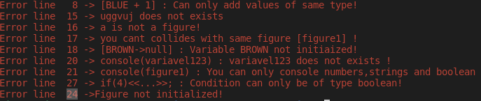

## Group members
&nbsp;

| NMec | Name | email | Contribution (%) | Detailed contribution [1]
|:-:|:--|:--|:-:|:--|
| 98221 | Bruno Braguês Costa Lemos | blemos@ua.pt | 16.(6)% | primary-grammar (16.(6)%) primary-semantic-analysis (20%) code-generation (50%) secondary-semantic-analysis (50%) secondary-semantic-analysis (50%) examples (16.(6)%) testing (50%) |
| 98189 | Joana Isabel Figueiredo Santos Cunha | joanasantoscunha@ua.pt | 16.(6)% | primary-grammar (20%)  primary-semantic-analysis (20%)   examples (16.(6)%)   DOC (50%) |
| 98372 | João António Silva Viegas | joao.antonio.viegas@ua.pt | 16.(6)% | primary-grammar (16.(6)%) primary-semantic-analysis (20%) secondary-semantic-analysis (50%) examples (16.(6)%)|
| 98373 | João Pedro Caldeira Amaral | jp.amaral@ua.pt | 16.(6)% | primary-grammar (16.(6)%) primary-semantic-analysis (20%) code-generation (50%) secondary-code-generation (50%) examples (16.(6)%)|
| 96141 | Gustavo Tupini Silveira | tupinigustavo@ua.pt | 16.(6)% | primary-grammar (16.(6)%) secundary-grammar (100%) examples (16.(6)%) testing (30%)|
| 98524 | Diana Da Cruz Rocha | rochadc00@ua.pt | 16.(6)% | primary-grammar (20%)  primary-semantic-analysis (20%)   examples (16.(6)%)   DOC (50%) |

[1] Topics: 
   primary-grammar (%) primary-semantic-analysis (%) code-generation (%) secondary-grammar (%) secondary-semantic-analysis (%) secondary-interpretation/secondary-code-generation (%) examples (%) testing (%) other (%) (explain)

- Beware that within the group the sum for each topic must be 100% (obviously).

## Material to be evaluated

- Beware that **only** the code in the **master** branch will be considered for evaluation.

## Compilaçao e execução
 Temos de estar no diretorio `geometrics-lfa-11`
 
 Para compilar a linguagem auxiliar temos de usar a script: `./auxiliar.sh <nomedoprograma.aux>`
 
 Para compilar  e executar a linguagem geometrics temos de usar a script: `./geometrics.sh <nomedoprograma.geo>`

## Trabalhos e exemples

Todos os nossos programas estão na pasta examples e para todos, o directorio para executar as Scripts é no geometrics-lfa-11.

`1. SpaceInvaders-Game`

   Como este jogo foi feito com a linguagem geometrics e a auxiliar temos de compilar primeiro a auxiliar e só depois compilar e executar a geometrics:
   
   - ./auxiliar.sh SpaceInvaders.aux
   
   - ./geometrics.sh SpaceInvaders.geo
   
   Este jogo consiste numa nave controlada com as setas do teclado pelo utilizador apenas na base do display. Se tocar nas laterais do display a nave movimenta-se para o lado oposto.
O objetivo do jogo é eliminar os inimigos que vão caindo do topo do display.
Temos 3 vidas, cada vez que um inimigo toca na base do display o jogador perde 1 vida.

`2. BrickBreaker-Game`

   Como este jogo foi feito apenas com a linguagem geometrics, portanto temos de compilar e executar usando:
   
   - ./auxiliar.sh BrickBreacker-Game.geo
   
   Esse é o famoso jogo BrickBreaker !!!
 
`3. Ballon-Game`

   Como este jogo foi feito apenas com a linguagem geometrics, portanto temos de compilar e executar usando:
   
   - ./geometrics.sh Ballon-Game.geo
   - 
       Este exemplo é um jogo em que o utilizador usa as setas do teclado para movimentar uma bola e apanhar os quadrados que surgem com uma animação de rotação no display.
     
   Assim que a bola toca nestes quadrados o raio da bola aumenta.
   Temos ainda inimigos que surgem no topo do mapa de forma aleatória. Se a bola que estamos a controlar tocar num destes inimigos ou nas bordas do ecrã perdemos o jogo. Temos ainda um contador de pontos! Podemos reiniciar o jogo clicando da tecla a
   
`4. TargetShotting-Game`

   Como este jogo foi feito apenas com a linguagem geometrics, portanto temos de compilar e executar usando:
   
   - ./geometrics.sh TargetShotting-Game.geo
   
   Neste jogo temos uma seta com a trajetória da bola, carregando no space a bola sai com o objetivo de acertar no inimigo que esta a rodar.
Cada vez que a bola toca no inimigo este é eliminado e surge um novo inimigo com o mesmo objetivo do anterior. Temos ainda um contador para o score. A tecla r dá reset ao lançamento.

`5. DVDPlayer-Animation`

   Como este jogo foi feito com a linguagem geometrics e a auxiliar temos de compilar primeiro a auxiliar e só depois compilar e executar a geometrics:
   
   - ./auxiliar.sh SpaceInvaders.aux
   - ./geometrics.sh SpaceInvaders.geo

   Esta animação é uma bola que vai batendo nas bordas do ecrã e mudando de cor inifinitamente até clicarmos na tecla esc ou sairmos.

`6. Relogio-Animation`
   
   Como este jogo foi feito apenas com a linguagem geometrics, portanto temos de compilar e executar usando:
   
   - ./geometrics.sh Relogio-Animation.geo
   
   Esta animacao consiste num relogio digital em que podemos acertar as horas clicando na tecla h e acertar os minutos na tecla m !! Na tecla escape o programa termina.
   As horas por default começam com 0:0:0 ! 

## Semantic error examples

   '/geometrics-lfa-11/Testes/teste2'
   
Neste ficheiro temos alguns erros controlados pela semantica como por exemplo:

 

      
